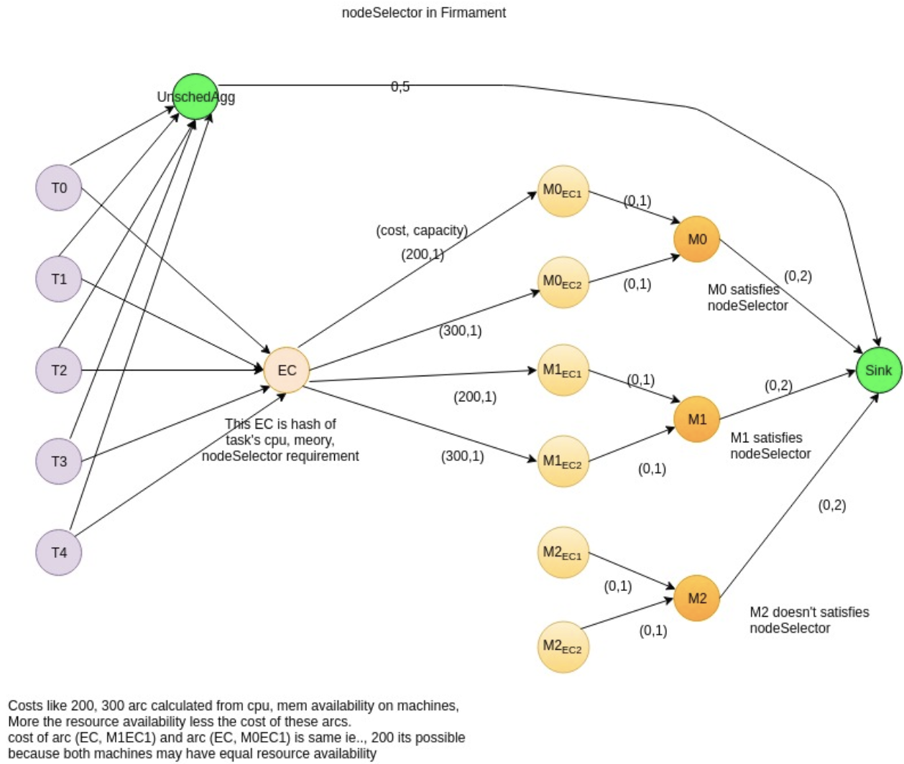
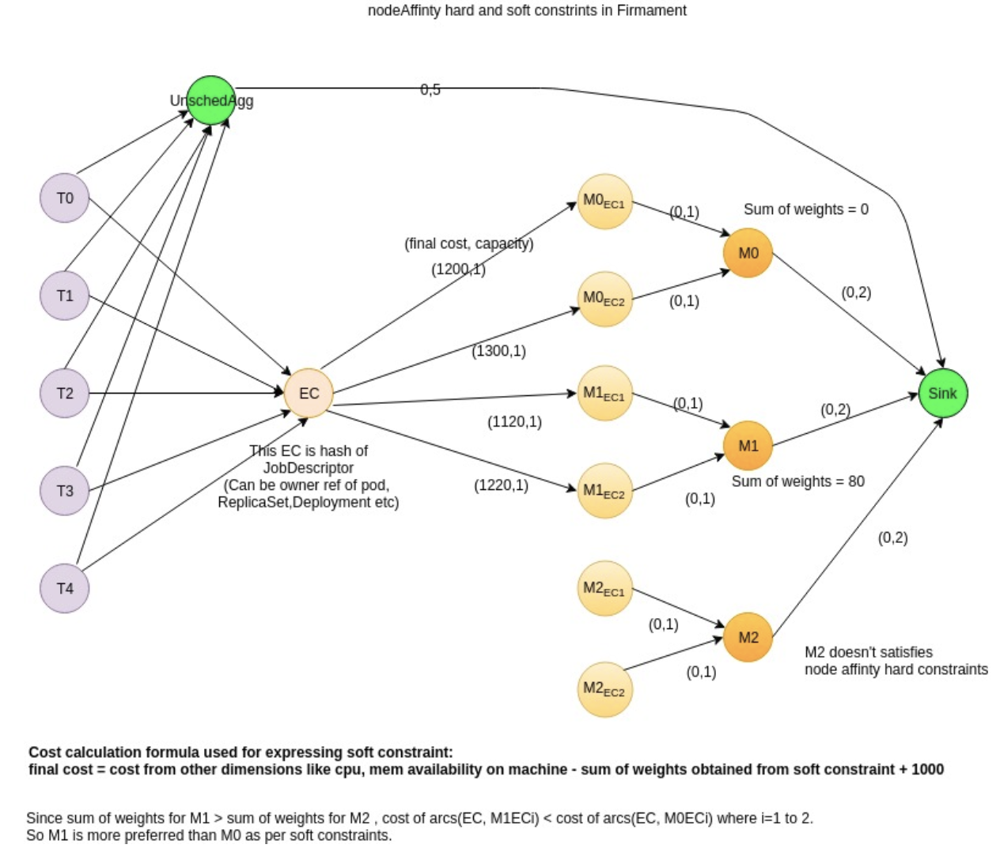

# Node Selector and Node Affinity Design for Firmament/Poseidon Scheduler

- [Motivation](#motivation)
    - [Goals](#goals)
    - [User Stories](#user-stories)
        - [Story 1](#story-1)
- [Proposed Design](#proposed-design)
    - [Firmament Design Details](#firmament-design-details)
        - [CPU-Memory Cost Model Overview](#cpu-memory-cost-model-overview)
        - [Key Processing Design Details](#key-processing-design-details)
            - [nodeSelector Approach](#nodeselector-approach)
            - [nodeAffinity Approach](#nodeaffinity-approach)
                - [Expressing Hard Constraints](#expressing-hard-constraints)
                - [Expressing Soft Constraints](#expressing-soft-constraints)
    - [Poseidon Design Details](#poseidon-design-details)

# Motivation

Firmament CPU/Memory multi-dimensional cost model (scheduling policy) typically does a reasonable placement (e.g. spread your pods across nodes, not place the pod on a node with insufficient free resources, etc.) but there are some circumstances where one may want more control on a node where a pod lands, e.g. to ensure that a pod ends up on a machine with an SSD attached to it etc. etc.

For a variety of reasons, a workload should only run on a specific type of hardware. Maybe one machine has faster disk speeds, another is running a conflicting application, and yet another is part of your bare-metal cluster. Each of these would be a good reason to run an application here instead of there, and being able to control where an application gets run can make all of the difference.
 
Purpose of this design document is to enable such node level affinity/anti-affinity functionality within Poseidon/Firmament scheduling environment.

## Goals

- Kubernetes implements node affinity using "nodeSelector" and "nodeAffinity" fields as part of the "PodSpec". Goal is to leverage these K8S pod definitions in order to enable node level affinity/anti-affinity functionality within Firmament scheduler.

## User Stories

### Story 1

A user is running a Kubernetes cluster on AWS and he wants to run an "Nginx" pod on "m3.medium" instance. He/she also wants a different "httpd" pod to only run in the "us-west-2" region and only on nodes where "example.com/load-balancer" key set to "true". Additionally,

- "httpd" should try to run on a node with the "x-web:yes" label, but can run anywhere.
- "Nginx" must run on a node with "y-web:yes" label and should fail if not.

# Proposed Design

## Firmament Design Details

### CPU-Memory Cost Model Overview

As a quick brief overview, Firmament scheduler models scheduling problem as a constraint-based optimization over a flow network graph. A min-cost flow algorithm is leveraged for deriving the implied workload placements. A flow network is a directed graph whose arcs carry flow from source nodes (i.e., pod nodes) to a sink node for a feasible solution to the optimization problem. A cost and capacity associated with each arc constrain the flow, and specify preferential routes for it.
 
In the CPU-Memory cost model, the task equivalence class (EC) gets created based on the task’s cpu and memory request. Each machine will have a set of predefined number of machine ECs (M0EC1, M0EC2,.., M2EC2) in order to do load distribution across filtered machines during each scheduling iteration.

It is important to highlight that if we have only one arc from task EC node to machine node, then there is a chance that all the incoming flows (tasks) flow across the single arc, and overloading the single machine with so many tasks even though there are machines with lot of available resources. So to avoid scheduling many tasks on a same machine, we use multiple arcs between task EC and machine nodes using intermediate machine EC nodes. We connect task EC to multiple machine ECs and then these machine ECs are connected to corresponding machine node. The capacity on the arc (task EC to machine EC) and arc (machine EC to machine node) is set to 1. And costs on arcs between task EC and machine ECs are assigned incrementally as shown in figure 1 below.

(Figure 1: CPU-Memory Cost Model Diagram)

Let us take an example where there are three machines M0, M1 & M2 and each machine has a capacity of 2 flows. Load distribution is achieved by assigning two arcs via corresponding machine ECs and the cost on each arc increases incrementally. In this case, arcs connecting to machine ECs for machine M0 have value of cost 100 and 200 respectively. Capacity on these arcs would be 1 each. In a nutshell, for each unit of capacity, there would be corresponding machine EC. The cost on these arcs would increase incremental in order to achieve load distribution across machines.

### Key Processing Design Details

#### nodeSelector Approach

**nodeSelector** is the simplest form of constraint. **nodeSelector** is a field of PodSpec. It specifies a map of key-value pairs. For the pod to be eligible to run on a node, the node must have each of the indicated key-value pairs as labels (it can have additional labels as well). The most common usage is one key-value pair.

For a combination of cpu request, memory request and nodeSelector we create a unique task EC (i.e., hash of cpu_request, memory request & nodeSelector requirement map). And all tasks nodes which have this combination of requirements are connected to this unique task EC. From this task EC we draw arcs to machine ECs of those machines that satisfy unique task EC’s combination of cpu request, memory request and nodeSelector requirement. In this way we make sure that flow generated by tasks flows via only those machine nodes which satisfy task’s cpu, memory and nodeSelector requirements. And cost on these arcs depends on available cpu and memory of the machine. This is as depicted in figure 2 below.

Figure 2: CPU Memory cost model and nodeSelector in firmament

#### nodeAffinity Approach

As mentioned in the previous section that nodeSelector provides a very simple way to constrain pods to nodes with particular labels. The affinity/anti-affinity feature, on the other hand, greatly expands the types of constraints one can express. The language is more expressive and one can indicate that the rule is "soft"/"preference" rather than a hard requirement, so if the scheduler can’t satisfy it, the pod will still be scheduled.

There are currently two types of node affinity definitions:

- "**requiredDuringSchedulingIgnoredDuringExecution**"(i.e. Hard Node Constraints)
- "**preferredDuringSchedulingIgnoredDuringExecution**"(i.e. Soft Node Constraints)

One can think of them as "hard" and "soft" respectively, in the sense that the former specifies rules that must be met for a pod to be scheduled onto a node (just like nodeSelector but using a much more expressive syntax), while the latter specifies preferences that the scheduler will try to enforce but will not guarantee.

#### Expressing Hard Constraints

As per kubernetes implementation, following steps provide a brief overview of how "Hard Node Constraint" functionality works using "requiredDuringSchedulingIgnoredDuringExecution" field which is defined as a part of the Firmament's task descriptor message structure.

- "requiredDuringSchedulingIgnoredDuringExecution" field is of data type "NodeSelector". A node selector represents the union "OR" of the results of one or more node selector terms over a set of nodes.
- A node selector term represents the "AND" of the requirements represented by the matchExpressions.
- A matchExpression is a selector that contains values, a key, and an operator that relates a key to the corresponding values.

For node affinity, we create unique task EC (which is the hash of JobDescriptor i.e., owner ref of kubernetes objects like ReplicaSet, Pod, Deployment etc). All task nodes which belong to a particular Job (or kubernetes object) are connected to this task EC. From this task EC, arcs are drawn to only those machine’s ECs where corresponding machine satisfies the hard constraints as explained above.

In the case of hard constraints, a task can only be placed on a machine if it meets requirement. Figure 3 shows a flow graph with hard constraints. Here machines M0 and M1 meet requirements and machine M2 do not meet requirements so arcs are drawn from task EC to machine ECs only for machines M0 and M1. 

(Figure 3: Example flow graph for node affinity soft and hard constraints)

#### Expressing Soft Constraints

This section captures details for expressing node level affinity/anti-affinity soft constraints by altering the cost of arc between task EC to machine ECs and at the same time do the load distribution across relevant machines. As per kubernetes implementation, following steps provide a brief overview of how "Soft Node Constraint" functionality works using "preferredDuringSchedulingIgnoredDuringExecution" field as defined part of the Firmament's task descriptor message structure. The scheduler will prefer to schedule pods to nodes that satisfy the affinity expressions specified by this field, but it may choose a node that violates one or more of the expressions.
- The node that is most preferred is the one with the greatest sum of weights, i.e. for each node that meets all of the scheduling requirements (resource request, requiredDuringScheduling affinity expressions, etc.), compute a sum by iterating through the elements of this field and adding "weight" to the sum if the node matches the corresponding matchExpressions; the node(s) with the highest sum are the most preferred, it is of data type "PreferredSchedulingTerm".
- PreferredSchedulingTerm consists of two fields i.e. weight and node selector term. An empty preferred scheduling term matches all objects with implicit weight 0. A null preferred scheduling term matches no objects.
- Node selector term of this field is same as that of "requiredDuringSchedulingIgnoredDuringExecution" field.
- Weight associated with matching the corresponding nodeSelectorTerm ranges from 1 to 100.

After satisfying hard constraints we have drawn arcs from task EC to machine ECs. And then cost on these arcs are assigned based on the available resources on that machine and summed weights of preferred (soft) constraints satisfied by the machine as explained in above steps.
 
For example, let us say machines M0, M1, M2 satisfy hard constraints and they are preferred differently by task. For each node that meets all of the scheduling requirements (resource request, requiredDuringScheduling affinity expressions, etc.), compute a sum by iterating through the elements of this preferred constraint field and adding "weight" to the sum if the node matches the corresponding matchExpressions.
 
This sum of weight is used to decrease the cost of the already drawn arc so that less cost will be assigned and hence node which has more sum of weight is more preferred.  So we can reduce the overall cost by this weight sum amount for simplicity. So higher the weight, less the cost and more is the chance of task getting scheduled on that machine. And we are adding some big positive number (1000) to keep cost of the arc positive, as some flow solver may expect positive cost.

## Poseidon Design Details

Firstly, Kubernetes affinity protobuf message structure from generated.proto is mapped to Firmament's task descriptor protobuf message structure.
 
The affinity data structure from kubernetes pod.spec is parsed to the Poseidon data structure by calling ParsePod function. The Poseidon data structure, in turn, is then converted to the affinity structure of task descriptor by calling the following functions:

- "getFirmamentNodeSelTerm()" and "getFirmamentPreferredSchedulingTerm()" for Node Affinity in Poseidon.
- "getFirmamentPodAffinityTerm()" and "getFirmamentWeightedPodAffinityTerm()" for Pod Affinity in Poseidon.
- "getFirmamentPodAffinityTermforPodAntiAffinity()"and "getFirmamentWeightedPodAffinityTermforPodAntiAffinity()" for Pod AntiAffinity in Poseidon.

The node selector data structure from kubernetes pod.spec is parsed to the Poseidon data structure by calling ParsePod function. This node selector data structure, in turn, is then converted to the corresponding data structure of task descriptor by calling function "getFirmamentLabelSelectorFromNodeSelectorMap()".	
 
The task descriptor data is then sent to the firmament by calling function addTasktoJob function within Poseidon.
